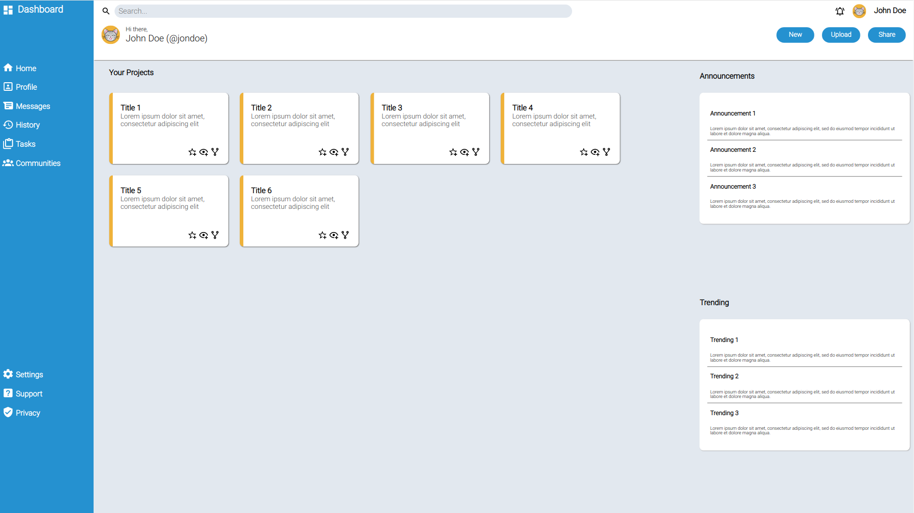
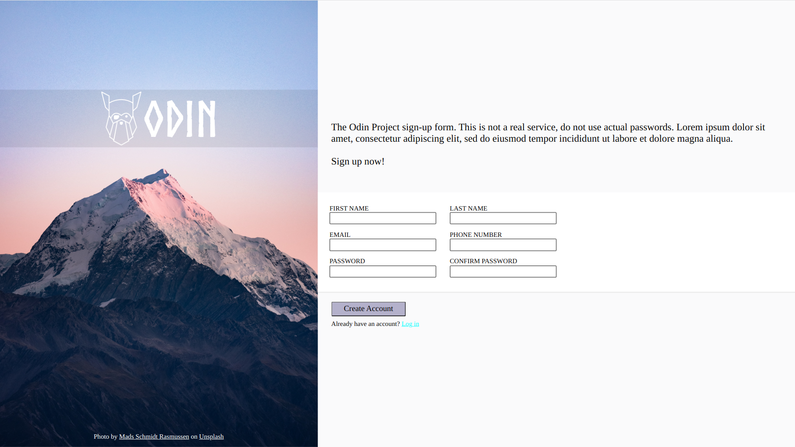

# The Odin Project 
**Status: In progress**

Learning some webdev during the summer!\
Here is a collection of projects/assignments completed, as recommended by the course\
Making things nice sure is hard!

## Screenshots
---
Here are some pictures of some of the nicer projects I have completed 

### Dashboard

### Signup form

## Others
---
There are also others done in seperate repos as per the recommendation from the tutorials
- [css-exercises](https://github.com/cliveong/css-exercises)
- [Odin recipes](https://github.com/cliveong/odin-recipes)
- [javascript-exercises](https://github.com/cliveong/javascript-exercises)
- [JavaScript30](https://github.com/cliveong/JavaScript30)